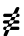
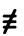

# x/image/font: wrong rendering of intersecting paths

When drawing text with `golang.org/x/image/font` using `Drawer.DrawString` it renders incorrect, if glyph paths are intersecting.

Freetype.png shows the result of `go run freetype.go`, which parses the font with `github.com/golang/freetype/truetype` and renders with `golang.org/x/image/font` `Drawer.DrawString`.
It renders U+2262 (not identical to) of the font APL386.


As a comparison, `go run raster.go` parses with `golang.org/x/font/sfnt` and renders with `golang.org/x/image/vector` using the methods of `sfnt.Example_rasterizeGlyph`


## Output of `go run raster.go`

```
........................
........................
........................
........................
........................
........................
........................
........................
........................
.............+88........
.............888+.......
............+888........
............888+........
...........+888.........
....+++++++8888.........
...8888888888888+.......
...8888888888888+.......
...+++++++8888++........
.........+888...........
.........888+...........
...+++++8888++++........
..+8888888888888+.......
...8888888888888+.......
.......888+.............
......+888..............
......8888..............
...8888888888888+.......
...8888888888888+.......
...++888++++++++........
....+88+................
....888+................
...+888.................
...888+.................
...+88..................
........................
........................
```

